# 像素美術風格測試 (P0) 審查首頁

本文件提供像素美術風格測試 (P0) 所有候選素材的完整預覽與設計差異說明。所有素材均**尚待使用者核准 (Pending Approval)**。

---

## 1. 主角概念設計候選 (Character Concepts)

包含正面、背面、側面以及三種表情 (認真、驚訝、裝作沒事)，無手持武器，大頭盔與短披風剪影。

| 候選方案 | 預覽圖 | 設計差異與特徵描述 | 狀態 |
| :--- | :---: | :--- | :--- |
| **c01 (經典款)** | 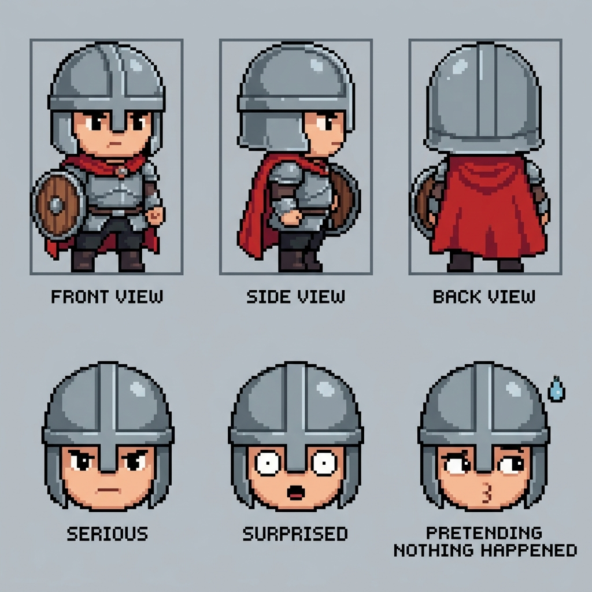 | 經典紅披風、鋼鐵質感圓頭盔、小圓盾及銀灰色護甲。外觀最具正統奇幻勇者風範，嚴肅認真與可愛度平衡極佳。 | 待核准 |
| **c02 (復古銅藍款)** | 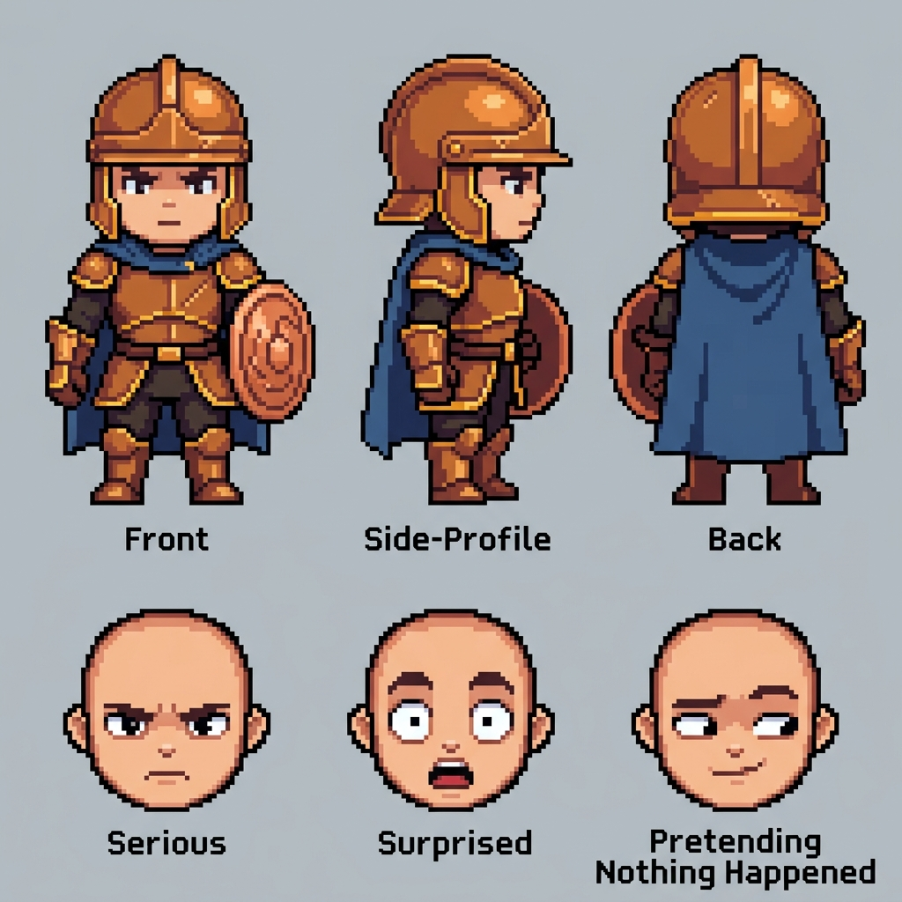 | 深藍色披風、古銅色頭盔配以金色鑲邊的護甲。色調偏向暖系，頭盔與盾牌帶有些許仿古青銅器的穩重感。 | 待核准 |
| **c03 (野外冒險款)** | 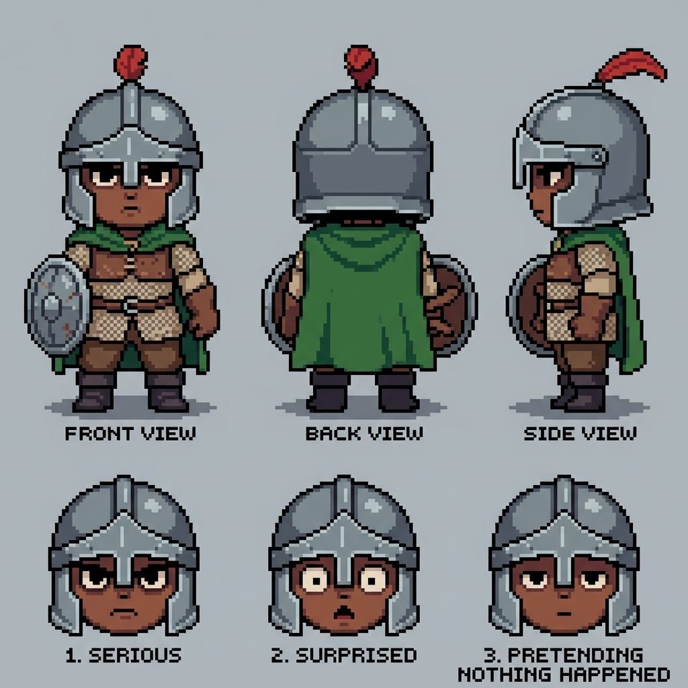 | 綠色短披風、帶有小羽飾的圓鐵盔、皮甲與鎖子甲複合護甲。給人一種更為輕盈、帶有些許新手冒險家笨手笨腳的生動感。 | 待核准 |

---

## 2. 第一關新手森林風格候選 (Level 1 Environment Styleframes)

規格尺寸為 960×540 比例。包含天空、山脈、遠方王城、圓潤樹木、古代遺跡、瞭望塔、草地平台、斷橋與深坑。畫面呈現完整、可愛且正統的奇幻平台冒險，沒有任何 Debug 或兒童教材感。

| 候選方案 | 預覽圖 | 氛圍與色彩設計差異 | 狀態 |
| :--- | :---: | :--- | :--- |
| **c01 (森林午後 - 亮綠調)** | 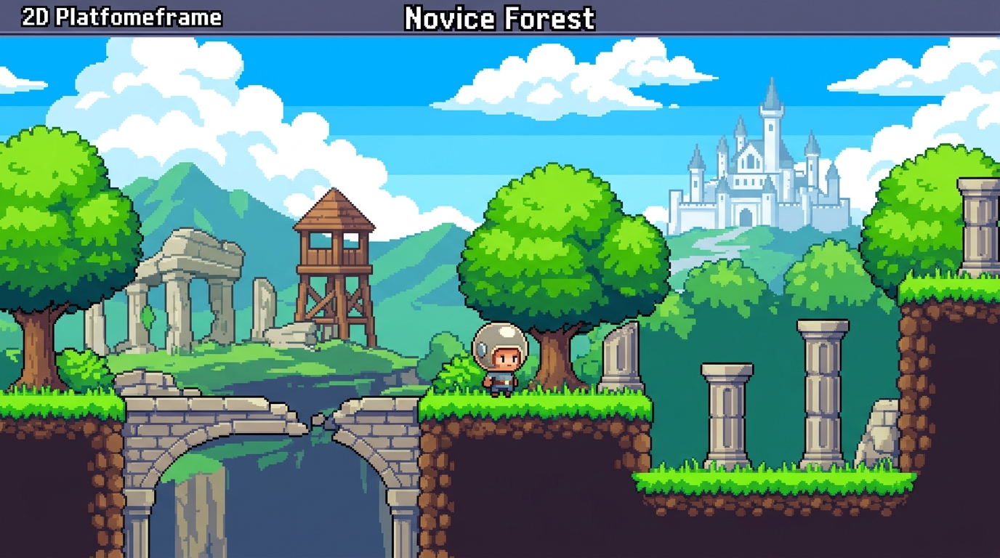 | 亮麗午後。明亮的天空藍與草綠色平台形成高對比，安全落腳點極為清晰，王城白色的剪影在遠方矗立，畫面極具活力。 | 待核准 |
| **c02 (森林黃昏 - 暖橘調)** | 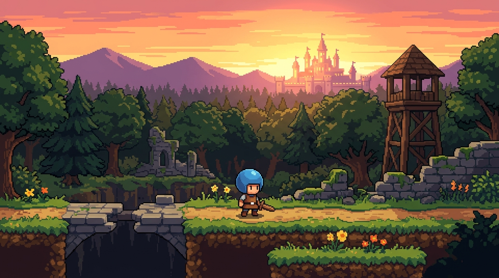 | 黃昏夕陽。天空染上溫暖的橘粉色，遠方王城呈現金黃光芒。平台與樹木的陰影較深，整體視覺層次豐富，帶有一種舒適的氛圍。 | 待核准 |
| **c03 (神秘清晨 - 青藍調)** |  | 晨霧清晨。淡青色與薄霧籠罩的遠山，呈現神秘而清爽的氛圍。冷色調的畫面使前景的綠色草地平台更加突出，視覺引導效果佳。 | 待核准 |

---

## 3. 手機可讀性縮圖預覽 (Mobile Readability Previews)

使用原風格圖以最鄰近插值 (Nearest Neighbor) 等比例縮小，確保像素點清晰，用以驗證主角、平台、坑洞在手機螢幕上是否依然可辨識。

### c01 (森林午後) 縮圖
* **480×270**：
  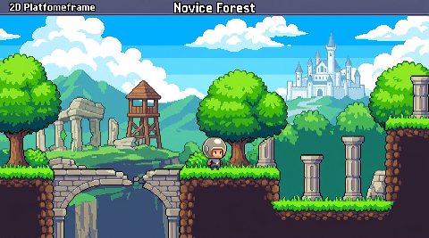
* **360×203**：
  

### c02 (森林黃昏) 縮圖
* **480×270**：
  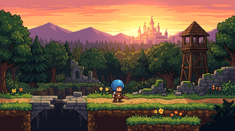
* **360×203**：
  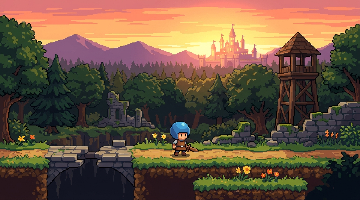

### c03 (神秘清晨) 縮圖
* **480×270**：
  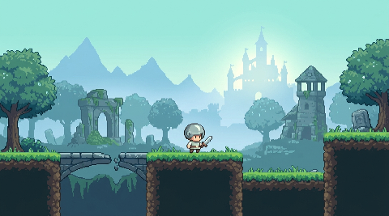
* **360×203**：
  

> [!NOTE]
> **可讀性評估**：經測試，在 360×203 尺寸下，安全草地平台的邊緣與斷橋坑洞的交界依然保持極高的輪廓對比度，背景王城與山脈對比度低，不搶戲，主角大頭盔的剪影形狀在此解析度下仍然能夠清楚被鎖定，可讀性優異。

---

## 4. 主角基礎動畫測試 (Hero Basic Poses)

基於選定的一致風格（以 c01 經典款為基礎），展開側視動作測試表。包含待機、跑步、起跳、下降與落地的關鍵姿勢。每格比例、服飾、色盤與像素密度完全一致。

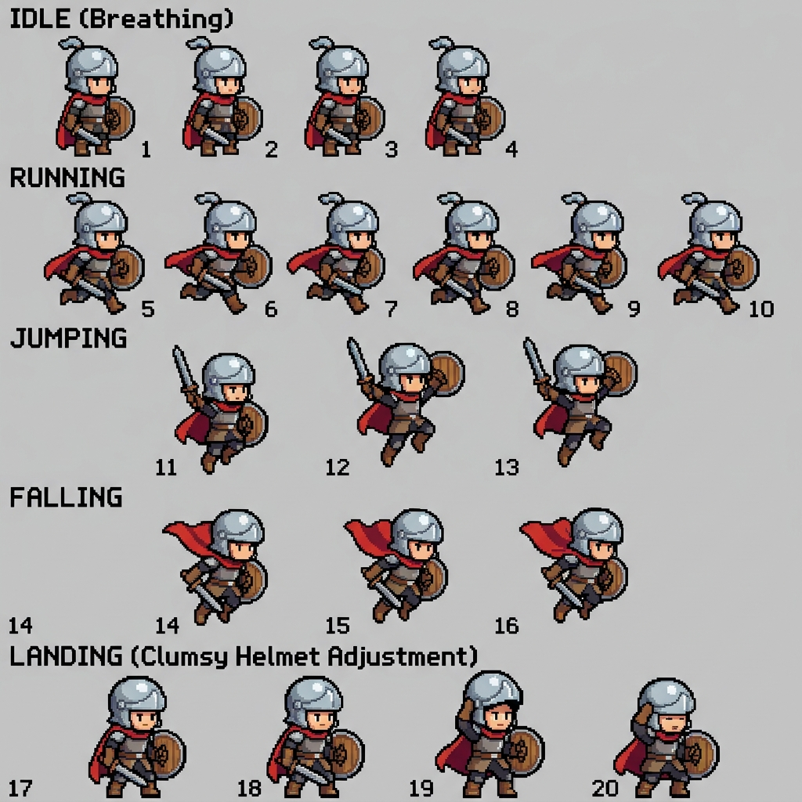
* **設計備註**：勇者在待機時挺胸、跑步時步伐略顯忙亂但上身維持正經、起跳上升時專注、下降時表情緊張、落地後笨拙地扶正稍微傾斜的圓頭盔。這五個關鍵姿勢成功展現出「假正經新手勇者」的性格特徵。

---

## 5. 史萊姆彈簧援助分鏡 (Slime Spring Storyboard)

5 格關鍵喜劇表演分鏡：
1. 勇者掉入坑洞。
2. 史萊姆出現並壓扁身體。
3. 史萊姆將勇者反彈拋起。
4. 勇者在空中露出驚訝的表情。
5. 勇者安全降落平台，立刻擺出挺胸的英雄姿態（假裝是自己完成的）。

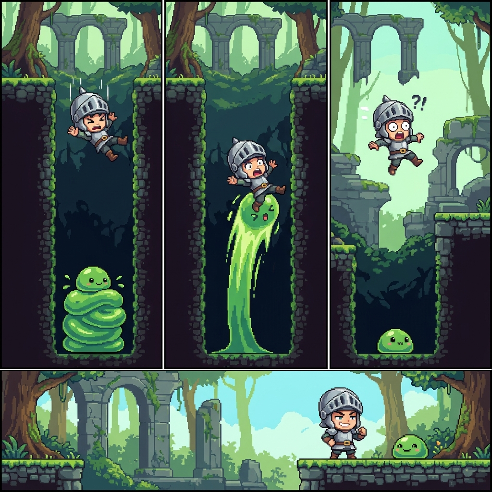
* **設計備註**：本分鏡無需任何台詞即可完全表達出「世界偷偷作弊幫助新手勇者，而勇者愛面子裝鎮定」的荒謬喜劇核心，動作張力十足。
