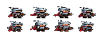
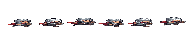
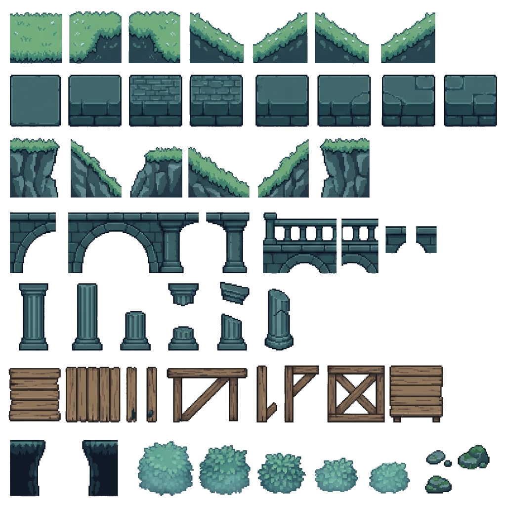

# P1 第一批生成素材技術審查

- 審查結論更新：2026-08-10
- 關聯規格：`docs/specs/SPEC-0005-art-style-baseline.md`
- 本批狀態：角色與史萊姆退件；森林地表僅限 placeholder
- 正式核准資產：無

本頁保存首批生成素材的預覽、技術問題與後續補件需求。它不是正式美術清單，也不表示檔案已取得風格、技術、來源或商業授權核准。

C01 的大圓盔、紅短披風、小圓盾只作主角造型 reference；C03 的冷青清晨、遠方王城與低對比景深只作環境氣氛 reference。`reference` 不等於選定現有 PNG，也不授權依此直接擴製 CHR-03～CHR-10。

## 狀態摘要

| 項目 | 狀態 | 可否作正式資產 | 結論 |
| --- | --- | --- | --- |
| C01 主角特徵 | 造型 reference | 否 | 可保留大圓盔、紅短披風、小圓盾的方向，現有 sheet 未核准 |
| C03 清晨森林 | 氣氛 reference | 否 | 可保留冷青晨霧、王城與景深方向，現有圖檔未核准 |
| `chr_hero_idle_sheet.png` | 退件 | 否 | 每格內容錯誤、有效輪廓不足，不得稱為正式待機動畫 |
| `chr_hero_run_sheet.png` | 退件 | 否 | 可見角色僅約 8–10px 高，與 32×48 規格不符 |
| `assist_slime_spring_sheet.png` | 退件 | 否 | 有效高度不足，部分幀近乎消失，無法穩定表達壓縮與彈起 |
| `tile_forest_ground.png` | 限定 placeholder | 否 | 不是規則 24×24 tileset，只能暫用人工確認的 atlas frame |

退件檔保留在本生成輸出目錄作為可追溯證據。`SPEC-0005` 要求後續實作停止載入主角與史萊姆退件 sheet；本文件更新本身不代表程式或正式 bundle 已完成撤回。

## 1. 主角造型 reference 與退件 sheet

### C01 造型 reference

可延續的方向：

- 稍微過大的鋼鐵圓頭盔。
- 紅色短披風。
- 小型圓盾。
- 簡單、正式但略不合身的護甲。
- 不持明顯武器，避免暗示攻擊操作。

上述特徵只用於下一輪小樣，不能回推成現有檔案已核准。

### 待機與呼吸（`chr_hero_idle_sheet.png`）

- 狀態：退件。
- 檔案尺寸：128×48px；名義上 4 格、每格 32×48px。
- 問題：切格後出現錯誤的雙重／迷你角色內容，有效輪廓高度也未達 `SPEC-0005` 的 38–44px 目標。
- 處置：保留原始檔作退件證據；不得作正式待機動畫、風格基準或後續動畫母版。
- 預覽：

  

### 跑步與移動（`chr_hero_run_sheet.png`）

- 狀態：退件。
- 檔案尺寸：192×48px；名義上 6 格、每格 32×48px。
- 問題：可見角色只有約 8–10px 高，像被壓扁，無法與待機、碰撞箱或手機畫面維持一致尺度。
- 處置：不得進入 `public`、正式 bundle 或作為 CHR-03～CHR-10 的比例依據。
- 預覽：

  

### 下一輪主角小樣門檻

- 先交待機、跑步、起跳、下降各一個可辨識關鍵姿勢，不直接製作完整 CHR-03～CHR-10。
- 每格保持 32×48px，有效輪廓高度 38–44px，腳底基線漂移不超過 1px。
- 角色在黑色剪影、960×540、844×390 與 375×667 實際遊戲縮放下仍可辨認朝向與動作。
- 服裝、比例、像素密度與受限色盤一致，不以 nearest-neighbor 縮小高解析角色冒充原生像素動畫。

## 2. C03 氣氛 reference 與森林地表 placeholder

### C03 氣氛 reference

可延續的方向：

- 冷青清晨與低對比遠景。
- 遠方王城、山脈、森林與遺跡的分層。
- 遊戲層對比高於中景與遠景。

不得直接裁切 P0 styleframe 作可玩背景，也不得將其中角色、武器、文字或假平台帶入遊戲。

### 森林地表（`tile_forest_ground.png`）

- 狀態：限定 placeholder，不是正式 tileset。
- 檔案尺寸：1024×1024px RGBA。
- 問題：內容未形成可依 24×24 規則切割的 grid，沒有可信的 margin、spacing、tile index 或完整 atlas 定義。
- 目前唯一允許用途：開發端人工確認的 `grass-platform` atlas frame，用來暫代穩定平台頂面；碰撞仍由程式資料定義。
- 禁止用途：自動按 24×24 切割、宣稱可水平／垂直完整拼接、替每段平台任意選框，或把整張 1024×1024 圖當正式地形載入。
- 預覽：

  

### 正式地表重交門檻

- 交付真正 24×24 模組，附 grid、margin、spacing、tile index 與用途圖。
- 至少包含草地頂面、土石本體、左右邊角、斷面、石橋、石柱、木板與坑洞邊緣。
- 使用核准的三層 token 色盤與左上光源；草、石、木各有一致三階明暗。
- 以 4×4 拼接樣本驗證無一像素裂縫、錯位或不合理重複。
- 若無法成為規則 tileset，必須正名為 object sheet 並提供正式 atlas JSON。

## 3. 史萊姆援助退件

### 史萊姆彈簧（`assist_slime_spring_sheet.png`）

- 狀態：退件。
- 檔案尺寸：192×32px；名義上 4 格、每格 48×32px。
- 原規劃語意：待機、壓縮、向上伸展、恢復。
- 問題：有效像素高度不足，部分幀在原始尺寸近乎消失；壓縮與恢復難以區分，也無法穩定提示實際彈射頂面。
- 處置：保留原始檔作 placeholder／退件證據；不得作正式援助動畫或風格核准依據。
- 預覽：

  

### 下一輪史萊姆小樣門檻

- 仍以 48×32px 每格交付，但每個狀態需有清楚可見輪廓。
- 附待機、準備、壓縮、彈起、恢復的語意名稱、建議 FPS、播放順序與碰撞頂面基線。
- 使用援助金／魔法青作次級焦點，不能只依賴與草地相近的綠色。
- 無字幕觀看時仍能理解史萊姆正在接住並彈回勇者，且不遮住下一落點。

## 4. 下一個美術協作閘門

下一輪只交低量小樣，順序如下：

1. 一組符合有效輪廓與腳底基線的主角關鍵姿勢。
2. 一組可辨識完整狀態的史萊姆彈簧。
3. 一份真正 24×24 的草／石／木小型 tileset 或正名後的 object sheet＋atlas。
4. 同一畫面的零死亡、首次死亡與公開援助實際遊戲縮放預覽。
5. 完整來源、模型／人工處理、色盤、尺寸、重現參數與商業使用授權說明。

以上小樣需先通過 `SPEC-0005` 的像素、色盤、跨裝置與狀態驗收，再決定正式資產製作方式及是否擴充動畫。不得再用「已選定」「核心正式素材」或「完成 tileset」描述尚未通過的檔案。
